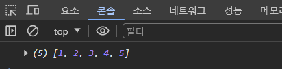
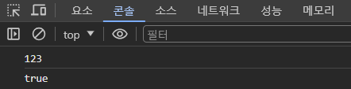
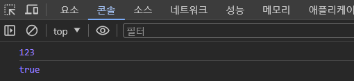
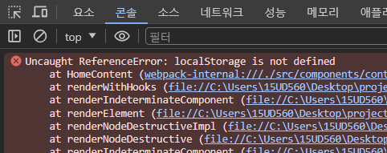

### 기존 localStorage의 문제점 및 불편한 점

프론트 개발을 하다보면 클라이언트의 데이터 값을 저장하기 위해서 브라우저 저장소인 localStorage를 사용합니다.

localStorage의 특징중 하나는 항상 문자 형태로 값을 저장해야 한다는 점과 값을 가져올 때마다 항상 문자 형태로 리턴이 된다는 점입니다.

이러한 점 때문에 Object(객체,배열) 타입의 경우 JSON.stringify 매서드를 사용하여 타입을 변환해준 후 값을 저장해야 하는 불편한 점이 생깁니다. 또한 number, boolean 형태로 값을 저장할 경우 값을 가져올 때마다 문자 타입의 형태로 리턴되어 한번더 타입을 체크 해야하는 불편한 점이 생기기 마련이고, 이는 결국 개발자의 실수로 이어져 에러가 발생될 확률이 높아집니다.

이러한 문제점들을 해결하고자 parser-storages 라는 라이브러리를 개발하게 되었습니다.

### 기존 localStorage와 parser-storages의 차이점

```jsx
import { parserLocalStorage } from "parser-storages"

// localStorage를 이용하여 [1,2,3,4,5] 라는 배열을 저장하는 코드
localStorage.setItem("test", JSON.stringify([1, 2, 3, 4, 5]))
console.log(JSON.parse(localStorage.getItem("test")))

// parserLocalStorage 라이브러리를 사용하여 [1,2,3,4,5] 라는 배열을 저장하는 코드
parserLocalStorage.set("test", [1, 2, 3, 4, 5])
console.log(parserLocalStorage.get("test"))
```



위 코드에서 처럼 따로 JSON 객체를 사용하지 않아도 라이브러리가 자동으로 파싱 해주어 코드가 좀 더 간결해졌습니다.

```js
localStorage.setItem("test", 123)
localStorage.setItem("test2", true)

console.log(localStorage.getItem("test"))
console.log(localStorage.getItem("test2"))
```



위 코드를 보시면 개발자는 분명히 숫자 123과 불리언 값 true를 저장하였지만 값을 가져와보니 문자 타입으로 변환되어 리턴되는 것을 볼 수 있습니다.

```js
import { parserLocalStorage } from "parser-storages"

parserLocalStorage.setItem("test", 123)
parserLocalStorage.setItem("test2", true)

console.log(parserLocalStorage.getItem("test"))
console.log(parserLocalStorage.getItem("test2"))
```



parser-storages 라이브러리를 사용하여 값을 저장하고 값을 가져온 결과입니다.

이처럼 어떤 타입으로 값을 저장하였는지를 판단하여 값을 가져올 때 자동으로 타입을 변환하여 리턴해줍니다.

### Next.js에서의 localStorage 문제점

```js
localStorage.setItem("foo", "bar")
```



Next.js 환경에서 localStorage 객체에 접근할시에 위와 같은 에러가 발생되게 됩니다.

위 에러가 발생하는 이유는 Next.js가 서버 사이드에서 미리 렌더링 되기 때문입니다.

localStorage는 브라우저 환경에서만 실행이 가능하기 때문에 서버 사이드에서 저 코드를 실행하면 정의되지 않다고 에러를 발생시키게 됩니다.

```js
if (typeof window !== "undefined") {
  localStorage.setItem("foo", "bar")
}
```

그래서 위와 같이 window 객체가 존재할 때, 즉 브라우저 환경에서만 실행하는 조건문을 걸어줘야 정상적으로 동작이 되는 것을 볼 수 있습니다.

localStorage를 사용하려면 조건문을 걸어줘야하니 개발자 입장에서는 매우 귀찮고 번거롭습니다. parser-storages 라이브러리에서는 이 문제를 해결하여 개발자가 조건문을 걸지 않아도 실행이 되게끔 개선하였습니다.
